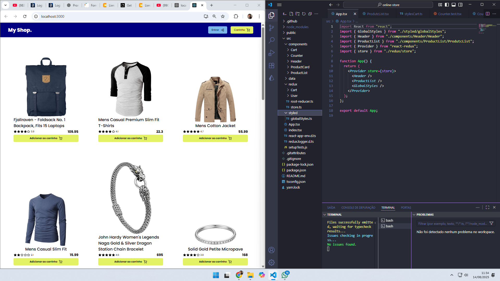

# 🚀 Online Store

  Front-end de e-commerce
  
 
## 📚 Índice
- [Sobre](#sobre)
- [Instalação](#instalação)
- [Uso](#uso)
- [Tecnologias](#tecnologias)
- [Contribuindo](#contribuindo)
- [Licença](#licença)

## Sobre

O projeto "Online Store" é uma página web desenvolvida para expor produtos de uma loja online. Ele conecta clientes aos produtos disponíveis da loja.

- **Carrinho** Carrinho lateral para acumular itens selecionados pelo cliente mostrando a quantidade, valor de cada item e soma de todos os itens.
- **Produtos** Cada produto é apresentado para o cliente com imagem, título, descrição, avaliação e preço.


## Instalação

Para configurar o projeto localmente, siga os passos abaixo:

1. Clone o repositório:

```bash
git clone https://github.com/LeonelPrestes/pronto-para-cozinha.git
cd pronto-para-cozinha
```

2. Instale as dependências do frontend:

```bash
npm install
```

## Uso

Para iniciar o aplicativo:

1. Em um terminal inicie o aplicativo frontend:

```bash
npm start
ou
yarn start
```

O aplicativo estará disponível em `http://localhost:3000` (ou outra porta, se indicado).

## Tecnologias

Este projeto foi desenvolvido utilizando as seguintes tecnologias:

- 🖥️ **Frontend:** React, TypeScript, Styled.Components.
- 📦 **Outras:** react, web-vitals, react-dom, react-icons
- 
## Contribuindo

Contribuições são bem-vindas! Para contribuir com o projeto, siga estas etapas:

1. Faça um fork do repositório.
2. Crie uma nova branch para sua feature (`git checkout -b feature/sua-feature`).
3. Faça suas alterações e commit-as (`git commit -m 'feat: Adiciona nova funcionalidade'`).
4. Envie para a branch original (`git push origin feature/sua-feature`).
5. Crie um Pull Request.

## Licença

Este projeto está sob a licença MIT. Veja o arquivo [LICENSE](LICENSE) para mais detalhes.


